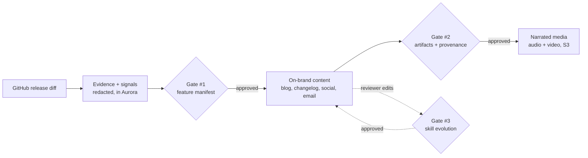

# ShipSignal

**Turn every GitHub release into approved, on-brand, multi-channel launch content — with claim-level provenance, human approval at every step, and a system that learns your brand voice over time.**

Built for the **[AWS hackathon · h01.devpost.com](https://h01.devpost.com/)**. Live on **Vercel**, with **Amazon Aurora PostgreSQL** as the system of record.

▶️ **Demo video (< 3 min):** https://youtu.be/oG0LAP4eT7U
🔗 **Live app:** https://shipsignal-xi.vercel.app
🎬 **Primary demo run (fully real, agentic commerce):** https://shipsignal-xi.vercel.app/releases/3b1fed7f-eba1-487e-8382-0de8c26a33f3
🎬 **Secondary run:** https://shipsignal-xi.vercel.app/releases/49a31f1c-0cc7-4a56-a410-edefbffb0d2b

---

## The problem (why this matters)
Engineering ships releases constantly. Turning each one into the **blog post, changelog, social posts, customer email, and demo video** is slow, manual, and off-brand — marketing re-writes what engineering already wrote, deadlines slip, the voice drifts, and **no one can trace a marketing claim back to the code that justifies it.** It's expensive, repetitive work that every software company does and nobody enjoys.

## What ShipSignal does
ShipSignal reads a release's **GitHub diff** and produces the full launch kit — release blog, changelog, LinkedIn/X posts, customer email, and a **narrated audio + video digest** — under three guarantees that make it safe to actually use:

1. **Evidence-backed, never hallucinated.** It never writes copy from a raw diff. It first builds an *evidence-backed feature manifest*, and every generated claim links to the concrete code/PR/issue evidence it came from — viewable as a provenance graph.
2. **Human-governed.** Three mandatory approval gates — feature manifest → generated artifacts → skill change — plus Amazon Bedrock Guardrails and deterministic PII/secret redaction. Nothing publishes without a human.
3. **Self-improving.** Reviewer edits and rejections are mined into a proposed *next-version skill*; once a human approves it, the system writes better, more on-brand content on the next release. It compounds.

The payoff: **diff → governed, on-brand, traceable, multi-channel launch content** — and one-click distribution (e.g. publish the demo video to YouTube).

## Who it's for
Software / dev-tools companies, DevRel, and product-marketing teams that ship often and need launch content that is fast, on-brand, **traceable, and governed** — without the manual grind.

## How it works
A GitHub diff flows through a LangGraph pipeline, with humans in the loop at three gates and a learning loop feeding back in:

- **Two detailed diagrams** — full system architecture **and** a dedicated skill-evolution (Gate #3) flow — are in **[demo/ARCHITECTURE.md](demo/ARCHITECTURE.md)**.

## Why Amazon Aurora PostgreSQL is the centerpiece (the data model *is* the product)
Every entity lives in Aurora; the schema encodes the product's guarantees across **38 migrations**:
- **Tenancy by construction** — every row is `release_run_id`-scoped with cascading FKs, so a GDPR erasure is a single delete.
- **A provenance graph** — `artifact_claims → evidence links → evidence_items`; no unlinkable claim is stored approved.
- **Real `pgvector` semantic search** — `vector(1536)` + HNSW, populated with **real Amazon Bedrock Titan embeddings** (verified cosine retrieval).
- **Behaviour-as-data** — versioned skills, capability/agent governance maps, and a self-learning ledger let the system evolve without code changes.
- **Encrypted connections** — OAuth tokens stored AES-256-GCM-encrypted for one-click publishing.

## Hackathon alignment ([h01.devpost.com](https://h01.devpost.com/))
| Requirement / criterion | How ShipSignal meets it |
|---|---|
| **AWS database** | **Amazon Aurora PostgreSQL (Serverless v2)** + `pgvector` — the single source of truth (38 migrations, provenance graph, real vector search) |
| **Deployed front-end (Vercel)** | Next.js/React 19 dashboard live at `shipsignal-xi.vercel.app`, reading Aurora over verified TLS |
| **Technological implementation / DB** | Deep, deliberate schema; real ingestion → persistence; real Bedrock Nova authoring + Titan embeddings |
| **Design** | Three-gate review/approval UX, evidence→claim provenance views, media preview + 1-click publish |
| **Impact** | A real, recurring, expensive workflow (every release) turned governed and traceable |
| **Originality** | Not "diff → blogpost" — an evidence-backed manifest → human-gated, claim-traceable content → a self-learning skill loop |

## Live demo & what's real
Two end-to-end runs are live on the dashboard:
- **Primary — `OrcaQubits/agentic-commerce-skills-plugins`** (run `3b1fed7f`): fully real — real diff → ~8,100 evidence rows → real Titan embeddings → **real Amazon Bedrock Nova authoring** → real ElevenLabs/ffmpeg media.
- **Secondary — `NousResearch/hermes-agent`** (run `49a31f1c`): the same, with the LLM authoring on an offline model (a deterministic, media-rich comparison).

Full honesty matrix (real vs. demo, with verification) → **[demo/VALIDATION.md](demo/VALIDATION.md)**.

## 📂 Demo artifacts
| Artifact | What it is |
|---|---|
| **[▶️ Demo video](https://youtu.be/oG0LAP4eT7U)** | < 3-min walkthrough of the live app (the agentic-commerce run, end to end) |
| **[demo/SUBMISSION.md](demo/SUBMISSION.md)** | The Devpost write-up — criteria-mapped, with live links + Team ID |
| **[demo/ARCHITECTURE.md](demo/ARCHITECTURE.md)** | Architecture + skill-evolution diagrams, and the Aurora data-model deep dive |
| **[demo/DEMO_SCRIPT.md](demo/DEMO_SCRIPT.md)** | The < 3-minute demo-video script (beat by beat) |
| **[demo/VALIDATION.md](demo/VALIDATION.md)** | Validation matrix — what's real, how it was verified |
| **[demo/assets/agentic_commerce_digest.mp3](demo/assets/agentic_commerce_digest.mp3)** · **[.mp4](demo/assets/agentic_commerce_digest.mp4)** | Real narrated media for the primary run (ElevenLabs + ffmpeg) |

## Tech stack
**Frontend/API:** Next.js (App Router) + React 19 on **Vercel** ·
**Database:** **Amazon Aurora PostgreSQL** (Serverless v2) + `pgvector` ·
**Storage:** **Amazon S3** (presigned-only media) ·
**LLM/AI:** **Amazon Bedrock** — Nova (authoring) + Titan (embeddings) + Guardrails ·
**Orchestration:** **LangGraph** (Python worker, 4 graphs) ·
**Media:** ElevenLabs TTS + ffmpeg.

## Status
38 Aurora migrations · 485 TypeScript + 420 Python tests green · deployed and live · two real end-to-end runs.
