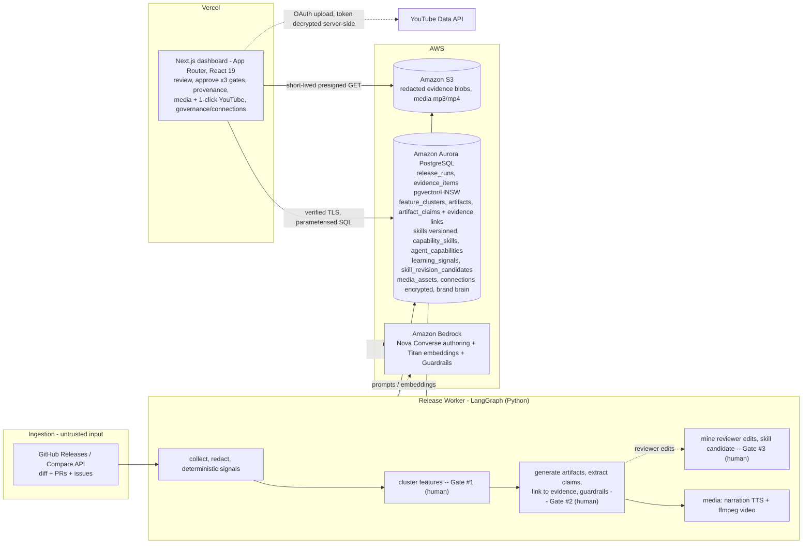
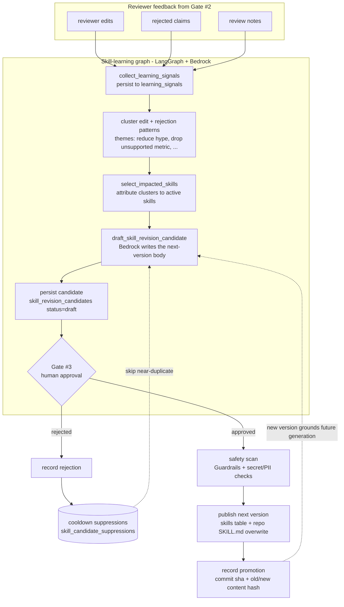

# ShipSignal — Architecture (h01.devpost.com)

**ShipSignal** turns a GitHub release diff into approved, on-brand, multi-channel launch content
(blog, changelog, social, customer email, narrated audio + video) — with **claim-level provenance**,
**three human approval gates**, and a **self-learning skill loop**. The system of record is **Amazon
Aurora PostgreSQL**.

## Key highlights
- **Amazon Aurora PostgreSQL is the product** — 38 migrations: a provenance graph, `pgvector`/HNSW
  semantic search, versioned skills + capability/agent governance, a self-learning ledger, and
  encrypted OAuth connections. Every row is `release_run_id`-scoped (single-delete GDPR erasure).
- **Real, end-to-end on real Amazon Bedrock** — the primary run (`OrcaQubits/agentic-commerce-skills-plugins`)
  is clustered + written by **Bedrock Nova**, embedded by **Titan** (8136/8136 rows), with verified
  pgvector retrieval — and narrated with real **ElevenLabs + ffmpeg** media.
- **Governed by design** — three mandatory **human approval gates** (feature manifest → artifacts →
  skill change) + Bedrock Guardrails + deterministic policy/PII redaction; **never** copy from a raw diff.
- **It self-improves** — reviewer edits are mined into a next-version skill (Gate #3); `brand-voice`
  was promoted to **v1.1.0** live.
- **Production-shaped** — verified-TLS serverless→Aurora, presigned-only S3 media, idempotent/dedupe
  publish, durable LLM cache, 1-click YouTube publish (encrypted token), 485 TS + 420 Python tests green.
- **Deployed** — Vercel (Next.js/React 19 dashboard) + Aurora + S3, all live.

## AWS database used
**Amazon Aurora PostgreSQL (Serverless v2)** — the single source of truth for every entity, with
`pgvector` (HNSW) for semantic retrieval. **38 migrations**, full CHECK/type constraints, a provenance
graph, versioned behaviour, and encrypted connections.

## Why the Aurora data model is the centerpiece
- **Tenancy by construction:** every row carries `release_run_id`; FKs `ON DELETE CASCADE` to
  `release_runs`, so GDPR erasure of one release is a single cascading delete across evidence,
  features, artifacts, claims, and media.
- **Provenance graph:** `artifact_claims → claim/feature_evidence_links → evidence_items`; no
  unlinkable claim is stored approved, and the lineage is rendered in the UI.
- **pgvector semantic retrieval (real):** `evidence_items.embedding vector(1536)` + an **HNSW cosine
  index** (migrations 0003 / 0018). **Real Bedrock Titan embeddings populated for ~8,900 evidence rows
  across runs** (8136/8136 on the primary agentic-commerce run; 741/747 on hermes); cosine retrieval
  verified end-to-end (e.g. "Medusa plugin security hooks" ranks the `medusa-commerce` hooks first).
  Lexical fallback covers the rest — Postgres-native, no extra service.
- **Behaviour-as-data:** a **versioned `skills`** store (`current_version` + `versions{}` JSONB), a
  **`capability_skills`** map and an **`agent_capabilities`** allowlist (both DB-overridable, edited
  from the dashboard), and a **self-learning ledger** (`learning_signals`, `skill_revision_candidates`,
  suppression cooldowns) — the system evolves without code changes. *(Live: `brand-voice` promoted to
  v1.1.0 through Gate #3.)*
- **Encrypted connections:** `connections` holds an OAuth refresh token **AES-256-GCM-encrypted**
  (ciphertext + IV + tag; key in env) for one-click YouTube publishing — ciphertext only in the DB.
- **Production-shaped rigor:** idempotent upserts, two-phase publish dedupe markers, a durable
  LLM-response cache, dedupe keys, and perf indexes for cross-run dashboard reads.

## Stack & data flow
**Vercel** (Next.js App Router + React 19) renders review/approval, provenance, media, and governance,
reading Aurora over **verified TLS** with parameterised SQL and reaching S3 only via **short-lived
presigned GET URLs**. A **LangGraph** Python worker runs four graphs — release-intelligence, content,
media, and skill-learning — orchestrating Gates #1–#3 as human-approval interrupts. **Amazon Bedrock**
(Converse + Guardrails + Titan) is the LLM layer.

## Skill evolution — the self-learning loop (Gate #3)
The system improves itself from human feedback. Reviewer edits and rejections from Gate #2 are mined,
clustered, and turned into a proposed **next-version skill** — which a third human gate must approve
before any repo `SKILL.md` is overwritten. This is what makes ShipSignal compounding, not static.

- **Suggestion criterion:** a recurring, themed pattern of reviewer corrections, attributable to the
  specific skill that grounded the corrected content (volume drives a displayed confidence). Near-
  duplicates of a recently-rejected proposal are suppressed by a cooldown — reviewers aren't re-nagged.
- **Promotion criterion:** a **human** at Gate #3 — there is deliberately no automated "this version is
  better" test (constitution non-goal). On approval the new version is published to the `skills` table
  and the repo `SKILL.md`, with the commit SHA + old/new content hashes recorded for provenance.
- **Proven live:** the `brand-voice` skill was promoted to **v1.1.0** through this exact loop
  (visible on `/skills` and `/learning`).

## Honest note for judges (live vs. demo)
The **primary run is fully real end to end**: `3b1fed7f`
(`OrcaQubits/agentic-commerce-skills-plugins`) was clustered + written by **Amazon Bedrock Nova**
(cross-account, since that account has Nova quota), embedded with real Titan vectors, and narrated with
real ElevenLabs/ffmpeg media. A secondary hermes run uses the offline `DemoModelClient` for the LLM
authoring only — **one `DEMO_MODE` flag** from live, and the agentic-commerce run is the proof. Schema,
data flow, gates, learning loop, and vector retrieval are exactly as shipped.
