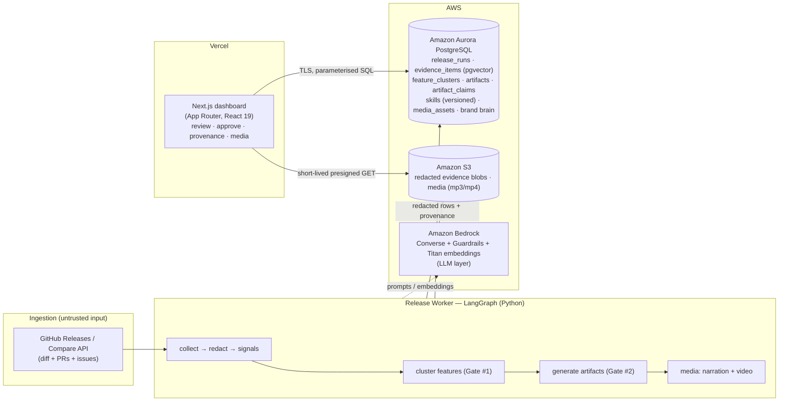

# ShipSignal — Architecture (H0 Hackathon)

**ShipSignal** turns a GitHub release diff into approved, on-brand, multi-channel marketing content
(blog, changelog, social, customer email, narrated audio/video) — with claim-level provenance and
three human approval gates. The system of record is **Amazon Aurora PostgreSQL**.

## AWS database used
**Amazon Aurora PostgreSQL (Serverless v2)** — the single source of truth for every entity, with
`pgvector` for semantic retrieval.

## Why the Aurora data model is the centerpiece
- **Tenancy by construction:** every row carries `release_run_id`; FKs `ON DELETE CASCADE` to
  `release_runs`, so GDPR erasure of one release is a single delete that cascades across evidence,
  features, artifacts, claims, and media.
- **Provenance lineage:** each generated claim links to the concrete evidence it came from
  (`artifact_claims` → `feature_evidence_links` → `evidence_items`); no unlinkable claim is stored
  approved.
- **pgvector semantic retrieval:** `evidence_items.embedding vector(1536)` (HNSW cosine index) powers
  evidence ranking and the brand-voice exemplar retrieval — Postgres-native vector search, no extra
  service.
- **Evolution as data:** a versioned `skills` store (`current_version` + `versions{}` JSONB) and a
  `capability_skills` mapping let the system's behaviour evolve without code changes.
- **34 deliberate migrations**, full type/CHECK constraints, idempotent upserts, and dedupe keys.

## Honest note for judges (what's live vs. demo)
The diff → evidence → deterministic-signals → **Aurora persistence** path runs on **real** GitHub
data (NousResearch/hermes-agent v0.16→v0.17). The **audio** is **real** (Amazon-quality TTS + ffmpeg).
The **LLM-written** feature manifest and artifact prose run on an **offline demo model** in this
deployment, because Amazon Bedrock on-demand inference is pending account activation — it is **not a
hackathon requirement**, and flipping one env flag swaps the live Bedrock client back in with zero
code change. The architecture, schema, and data flow are exactly as shipped.
