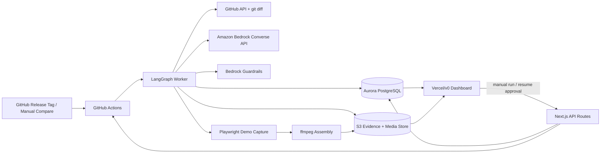
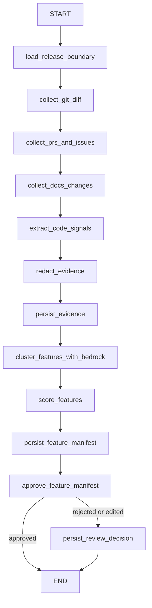
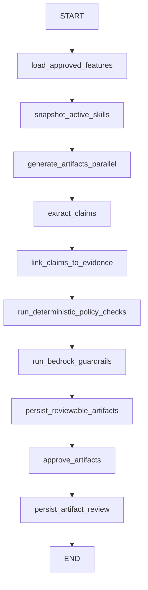
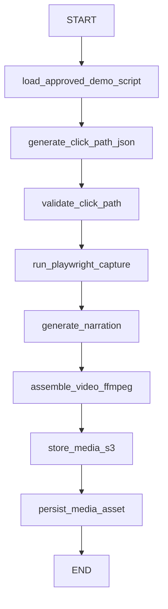
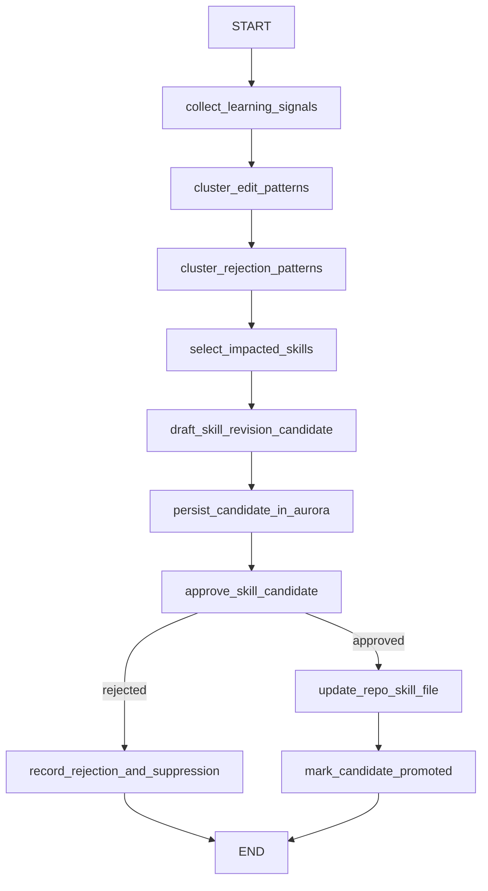

# Release-to-Content Engine — Slim Technical Product Spec

**Version:** 1.1 slim architecture rewrite  
**Date:** 2026-06-05  
**Base document:** `build-recommendations-functional.md` and prior LangGraph technical rewrite  
**Primary product:** Internal release-to-content engine that reads product-release diffs and related engineering/product context, then generates reviewable marketing, sales, and demo content with evidence provenance.  
**Hackathon context:** H0: Vercel/v0 + AWS Databases. The architecture intentionally uses Aurora PostgreSQL as the deliberate data model and provenance system while avoiding unnecessary AWS service sprawl.

---

## 0. Executive Summary

This spec replaces the earlier broader architecture with a smaller, more buildable stack:

```text
Vercel/v0 dashboard
GitHub Actions runner
LangGraph orchestration
Aurora PostgreSQL Serverless v2 + pgvector
Amazon Bedrock Converse API
Bedrock Guardrails
S3 artifact store
Playwright + ffmpeg demo capture
ElevenLabs narration
```

The central design principle remains unchanged:

> Do not generate marketing or sales content directly from raw code diffs. First build an evidence-backed feature manifest, get human approval, then generate content with claim-level provenance.

The key refinement in this version is the **skills architecture**:

- Canonical skills live in the project repository as `skills/**/SKILL.md`.
- Aurora acts as a **secondary staging, telemetry, and provenance layer** for skills.
- Aurora records skill snapshots, skill usage, reviewer edits, learning signals, proposed skill revisions, approval decisions, and promotion history.
- When an approver accepts a skill change, the system replaces the old repo `SKILL.md` with the approved new version and records the resulting commit SHA in Aurora.

Work sequencing is described as **phases**, not calendar-bound weeks.

---

## 1. Product Goals

### 1.1 Core goals

The product should:

1. Detect release boundaries from GitHub release tags, workflow dispatch, or manual compare ranges.
2. Read codebase diffs plus PRs, issues, docs, tests, and optional product context.
3. Extract deterministic code signals that indicate user-facing product changes.
4. Cluster evidence into candidate feature objects.
5. Require a human approval gate before downstream content generation.
6. Generate marketing and enablement artifacts:
   - release blog/changelog draft,
   - sales one-pager,
   - LinkedIn/social snippets,
   - demo script,
   - release audio digest,
   - optional demo-video click path.
7. Link every generated claim back to concrete evidence.
8. Use review edits and rejections to propose skill improvements.
9. Keep canonical skills in the repo while using Aurora for self-learning provenance and staged skill-evolution approvals.
10. Provide a clean Vercel/v0 dashboard for release review, feature approval, artifact review, and skill proposal approval.

### 1.2 Non-goals for the first complete version

The product should not initially attempt:

- full autopublishing without human approval,
- generalized AI video generation,
- full training-video generation,
- multi-source-control support beyond GitHub,
- Bedrock Knowledge Bases,
- Bedrock Agents,
- Step Functions,
- EventBridge,
- Lambda/ECS deployment,
- self-hosted LLM serving,
- complex statistical skill-promotion tests.

These can be revisited after the core release-to-content loop works reliably.

---

## 2. Slim Technology Stack

### 2.1 Keep

| Layer | Choice | Purpose |
|---|---|---|
| Frontend | Vercel/v0 Next.js app | Review dashboard, approvals, artifact previews, skills admin |
| Job runtime | GitHub Actions | Runs release analysis and generation jobs close to the repo |
| Orchestration | LangGraph | Agent workflow, conditional routing, approval interrupts, retries, graph state |
| Database | Aurora PostgreSQL Serverless v2 + pgvector | Release provenance, content provenance, skill learning ledger, vector search |
| Model gateway | Amazon Bedrock Converse API | LLM calls for extraction, clustering, generation, evaluation |
| Safety | Deterministic checks + Bedrock Guardrails | Output redaction, PII/sensitive info checks, unsupported-claim checks |
| Object storage | S3 | Raw evidence bundles, screenshots, generated media, audio, rendered assets |
| Demo capture | Playwright + ffmpeg | Deterministic browser demo recording and video assembly |
| Narration | ElevenLabs | Demo/audio narration using existing subscription |

### 2.2 Cut or defer

| Deferred item | Reason |
|---|---|
| Claude SDK | Not required. Use LangGraph + Bedrock Converse. |
| Step Functions | Duplicates LangGraph approval/state flow for this phase. |
| EventBridge | GitHub Actions + dashboard-triggered workflow dispatch is sufficient. |
| Lambda | Adds IAM/package complexity without enough value for MVP. |
| ECS/Fargate | Useful later for heavy video rendering, but not needed yet. |
| Bedrock Knowledge Bases | Aurora + pgvector can serve retrieval and provenance needs first. |
| Bedrock Agents | LangGraph is the agent runtime. |
| CloudWatch/X-Ray deep observability | Store telemetry in Aurora initially. |
| Secrets Manager | Production option. Use GitHub/Vercel/AWS env secrets for initial build. |
| Remotion | Defer until branded programmatic video templates are needed. Start with ffmpeg. |

---

## 3. High-Level Architecture



### 3.1 Runtime split

- **GitHub Actions** runs the long job: repo checkout, diff analysis, LangGraph execution, Playwright, ffmpeg.
- **Vercel/v0** hosts the dashboard and thin API routes.
- **Aurora** persists structured state and approval status.
- **S3** stores large binary or raw artifacts.
- **LangGraph** owns graph control flow, interrupts, retry logic, and state transitions.

### 3.2 Core one-liner

> LangGraph is the brain. GitHub Actions is the runner. Aurora is the release/content/learning ledger. Skills live canonically in the repo. Bedrock is the model and safety gateway. S3 stores heavy evidence and media. Vercel/v0 is the review surface.

---

## 4. Core Product Flow

```text
Release trigger
  → collect release evidence
  → redact and normalize evidence
  → extract deterministic product-change signals
  → cluster evidence into candidate features
  → human gate #1: approve feature manifest
  → generate content artifacts
  → extract and validate claims
  → run guardrails and deterministic checks
  → human gate #2: approve artifacts
  → optionally generate demo media
  → capture review edits and learning signals
  → propose skill revisions
  → human gate #3: approve skill replacement
  → replace repo SKILL.md and record provenance in Aurora
```

---

## 5. LangGraph Design

### 5.1 Graphs

Use four small graphs instead of one monolithic agent.

| Graph | Responsibility |
|---|---|
| `release_intelligence_graph` | Build evidence and approved feature manifest |
| `content_generation_graph` | Generate artifacts from approved features |
| `media_generation_graph` | Generate demo video/audio assets for selected features |
| `skill_learning_graph` | Mine review feedback and propose skill revisions |

### 5.2 Release intelligence graph



### 5.3 Content generation graph



### 5.4 Media generation graph



### 5.5 Skill learning graph



### 5.6 Human approval gates

Use LangGraph interrupts for approval gates:

1. **Gate #1:** approve/edit/reject feature manifest.
2. **Gate #2:** approve/edit/reject generated artifacts.
3. **Gate #3:** approve/reject proposed skill revision.

Each gate should surface a JSON payload to the Vercel dashboard and resume the same `thread_id` when a reviewer acts.

Example interrupt payload:

```json
{
  "gate": "feature_manifest_approval",
  "release_run_id": "relrun_001",
  "thread_id": "lg_thread_001",
  "features_pending_review": 4,
  "dashboard_url": "https://app.example.com/releases/relrun_001/review"
}
```

---

## 6. Evidence Model

### 6.1 Evidence sources

| Evidence source | Examples |
|---|---|
| Git diff | changed files, hunks, deleted/added strings |
| PR metadata | title, body, labels, reviewers, linked issues |
| Issues/Jira/Linear | user story, acceptance criteria, product intent |
| Docs changes | release notes, docs updates, API reference changes |
| Code signals | routes, UI strings, feature flags, schema migrations, public API changes |
| Tests | new e2e tests, UI tests, acceptance tests |
| Existing content | previous launch notes, sales docs, help-center docs |

### 6.2 Deterministic code signal extractors

Start with lightweight deterministic extractors before AST-heavy tooling.

| Extractor | Output |
|---|---|
| `extract_ui_strings` | new or changed user-visible labels, buttons, error messages, empty states |
| `extract_routes` | new frontend/backend routes and API endpoints |
| `extract_feature_flags` | new flags, flag defaults, rollout hints |
| `extract_schema_changes` | migrations, new tables/columns, enum changes |
| `extract_public_api_changes` | exported functions/types, OpenAPI changes, SDK changes |
| `extract_tests` | new or changed tests that describe user behavior |
| `extract_docs_delta` | docs pages, headings, release-note fragments |

### 6.3 Evidence item contract

```json
{
  "evidence_id": "ev_123",
  "release_run_id": "relrun_001",
  "evidence_type": "ui_string_change",
  "source": "git_diff",
  "repo": "org/product",
  "file_path": "src/features/onboarding/Checklist.tsx",
  "source_url": "https://github.com/org/product/pull/2214/files",
  "raw_excerpt_s3_uri": "s3://release-content/evidence/relrun_001/ev_123.txt",
  "redacted_excerpt": "Add button: Create onboarding checklist",
  "symbol_name": "OnboardingChecklist",
  "confidence": 0.86,
  "risk_flags": [],
  "metadata": {
    "pr_number": 2214,
    "commit_sha": "abc123",
    "line_range": "42-58"
  }
}
```

---

## 7. Feature Manifest

The feature manifest is the contract between evidence intelligence and content generation.

```json
{
  "release_run_id": "relrun_001",
  "repo": "org/product",
  "base_ref": "v1.12.0",
  "head_ref": "v1.13.0",
  "features": [
    {
      "feature_id": "feat_001",
      "title": "Admin-configurable onboarding checklist",
      "summary_internal": "Admins can now create and assign onboarding checklists for new team members.",
      "user_value": "Reduces manual onboarding work and gives managers a repeatable rollout flow.",
      "audiences": ["admin", "customer_success", "buyer"],
      "change_type": "new_feature",
      "surface_area": ["web_app", "admin_console"],
      "marketability_score": 0.78,
      "demoability_score": 0.91,
      "confidence": 0.84,
      "launch_risk": "medium",
      "evidence_ids": ["ev_123", "ev_124"],
      "demo_steps_draft": [
        "Open Admin Settings",
        "Navigate to Onboarding",
        "Create checklist",
        "Assign to new user"
      ],
      "approved_status": "pending_review"
    }
  ]
}
```

Feature candidates should not automatically become artifacts. A reviewer must approve, edit, or reject them first.

---

## 8. Content Artifacts

### 8.1 Initial artifact types

| Artifact | Description |
|---|---|
| `release_blog` | External or internal blog-style release story |
| `changelog_entry` | Short product changelog item |
| `sales_onepager` | Sales-facing summary with value prop, use cases, objections, talk track |
| `linkedin_post` | Short social announcement |
| `demo_script` | Script and screen-flow plan for demo video |
| `release_audio_digest` | Short narrated internal summary |

### 8.2 Deferred artifact types

| Artifact | Defer reason |
|---|---|
| `full_training_video` | Requires more robust media pipeline and curriculum design |
| `battlecard_delta` | Useful, but can follow sales one-pager |
| `localized_assets` | Needs localization workflow and review |
| `autopublished_assets` | Requires stronger governance and permissions |

### 8.3 Claim-level contract

Every generated artifact should be decomposed into claims.

```json
{
  "artifact_id": "art_001",
  "claims": [
    {
      "claim_id": "claim_001",
      "claim_text": "Admins can now create reusable onboarding checklists.",
      "claim_type": "capability",
      "support_status": "supported",
      "risk_level": "low",
      "evidence_ids": ["ev_123", "ev_124"]
    },
    {
      "claim_id": "claim_002",
      "claim_text": "This reduces onboarding time by 50%.",
      "claim_type": "performance",
      "support_status": "unsupported",
      "risk_level": "high",
      "evidence_ids": []
    }
  ]
}
```

Unsupported or high-risk claims should be blocked or flagged before artifact approval.

---

## 9. Skills Architecture

### 9.1 Canonical skill source

Skills live canonically in the project repository:

```text
skills/
  brand-voice/SKILL.md
  product-context/SKILL.md
  audience-map/SKILL.md
  blog-format/SKILL.md
  sales-onepager-format/SKILL.md
  demo-script-format/SKILL.md
  redaction-rules/SKILL.md
```

A skill file should include frontmatter:

```markdown
---
name: brand-voice
version: 1.3.0
owner: marketing
status: active
evolvable: true
last_promoted_candidate_id: cand_123
---

# Brand Voice

Guidance goes here.
```

### 9.2 Aurora role in skills

Aurora is not the canonical skills registry. Aurora is the **skills staging and self-learning provenance ledger**.

Aurora stores:

- skill snapshots from repo checkout,
- skill content hashes,
- active commit SHAs,
- skill usage per graph node and artifact,
- reviewer edits and rejection signals,
- mined learning patterns,
- proposed skill replacement bodies,
- approval/rejection decisions,
- promotion commit SHAs,
- old and new content hashes.

### 9.3 Skill lifecycle

```text
1. Canonical skill exists in repo:
   skills/brand-voice/SKILL.md

2. Release run starts:
   GitHub Actions checks out repo.
   LangGraph reads skills from repo.
   Aurora records skill snapshot metadata and content hash.

3. Artifact generation runs:
   LangGraph records which skill versions were loaded by which node.

4. Reviewers edit/reject artifacts:
   Aurora records edit diffs, rejected claims, reviewer notes, and related skill snapshots.

5. Skill miner proposes improvement:
   Aurora stores a candidate replacement body and supporting evidence.

6. Approver reviews candidate in dashboard:
   UI shows current repo skill, proposed skill, diff, supporting signals, and risk.

7. Approver accepts:
   System replaces the repo SKILL.md file with the approved new body.

8. Promotion is recorded:
   Aurora marks the candidate promoted and stores commit SHA, old hash, new hash, reviewer, and timestamp.

9. Future runs use the new repo skill:
   Aurora snapshots the new active skill version during the next run.
```

### 9.4 Skill replacement rules

1. The system must never silently overwrite a repo skill from Aurora.
2. A staged skill candidate must be explicitly approved by a human.
3. Promotion should happen by replacing the existing `SKILL.md` at the same repo path.
4. The safest path is a generated pull request; the hackathon-fast path is a direct file update to a controlled branch.
5. Aurora must preserve old and new hashes even after the repo file is replaced.
6. Rejected candidates must stay in Aurora with rejection reasons.
7. Near-duplicate rejected candidates should be suppressed for a cooldown period.

### 9.5 Proposed skill UI

The dashboard should show:

```text
Skill: brand-voice
Current version: 1.3.0
Proposed version: 1.4.0
Candidate source: voice_miner
Confidence: 0.78
Supporting signals: 8 reviewer edits across 4 artifacts
Likely impact: reduce hype language and remove unsupported ROI claims

Left panel: current SKILL.md
Right panel: proposed SKILL.md
Bottom panel: supporting review edits and rejected claims
Actions: Approve and replace repo skill | Reject | Request changes
```

---

## 10. Aurora Data Model

Use Aurora as a deliberate relational provenance system, not a generic key-value store.

### 10.1 Release and evidence tables

```sql
create table release_runs (
  id uuid primary key,
  repo text not null,
  base_ref text not null,
  head_ref text not null,
  trigger_type text not null,
  status text not null,
  langgraph_thread_id text,
  run_metadata_json jsonb not null default '{}',
  started_at timestamptz not null default now(),
  completed_at timestamptz
);

create table evidence_items (
  id uuid primary key,
  release_run_id uuid not null references release_runs(id),
  evidence_type text not null,
  source text not null,
  source_url text,
  repo text not null,
  file_path text,
  symbol_name text,
  raw_excerpt_s3_uri text,
  redacted_excerpt text,
  embedding vector(1536),
  confidence numeric,
  risk_flags jsonb not null default '[]',
  metadata_json jsonb not null default '{}',
  created_at timestamptz not null default now()
);
```

### 10.2 Feature tables

```sql
create table feature_clusters (
  id uuid primary key,
  release_run_id uuid not null references release_runs(id),
  title text not null,
  summary_internal text,
  user_value text,
  audiences text[] not null default '{}',
  change_type text,
  surface_area text[] not null default '{}',
  marketability_score numeric,
  demoability_score numeric,
  confidence numeric,
  launch_risk text,
  status text not null default 'pending_review',
  reviewer_notes text,
  created_at timestamptz not null default now(),
  updated_at timestamptz not null default now()
);

create table feature_evidence_links (
  feature_id uuid not null references feature_clusters(id),
  evidence_item_id uuid not null references evidence_items(id),
  relevance_score numeric,
  primary key(feature_id, evidence_item_id)
);
```

### 10.3 Artifact and claim tables

```sql
create table artifacts (
  id uuid primary key,
  release_run_id uuid not null references release_runs(id),
  feature_id uuid references feature_clusters(id),
  artifact_type text not null,
  title text,
  body_markdown text,
  s3_uri text,
  status text not null default 'draft',
  model_id text,
  prompt_version text,
  skill_versions_json jsonb not null default '{}',
  created_at timestamptz not null default now(),
  updated_at timestamptz not null default now()
);

create table artifact_claims (
  id uuid primary key,
  artifact_id uuid not null references artifacts(id),
  claim_text text not null,
  claim_type text not null,
  support_status text not null,
  risk_level text not null,
  checker_metadata_json jsonb not null default '{}',
  created_at timestamptz not null default now()
);

create table claim_evidence_links (
  claim_id uuid not null references artifact_claims(id),
  evidence_item_id uuid not null references evidence_items(id),
  support_score numeric,
  primary key(claim_id, evidence_item_id)
);
```

### 10.4 Approval tables

```sql
create table approvals (
  id uuid primary key,
  target_type text not null,
  target_id uuid not null,
  decision text not null,
  reviewer text not null,
  notes text,
  edited_payload_json jsonb,
  created_at timestamptz not null default now()
);
```

### 10.5 Skill provenance tables

```sql
create table skill_repo_snapshots (
  id uuid primary key,
  repo text not null,
  skill_name text not null,
  skill_path text not null,
  skill_version text,
  commit_sha text not null,
  content_hash text not null,
  frontmatter_json jsonb not null default '{}',
  body_excerpt text,
  is_active boolean not null default true,
  synced_at timestamptz not null default now(),
  unique(repo, skill_path, commit_sha)
);

create table skill_usage_events (
  id uuid primary key,
  release_run_id uuid references release_runs(id),
  artifact_id uuid references artifacts(id),
  graph_name text not null,
  node_name text not null,
  skill_snapshot_id uuid references skill_repo_snapshots(id),
  skill_name text not null,
  skill_version text,
  content_hash text not null,
  usage_type text not null,
  created_at timestamptz not null default now()
);

create table learning_signals (
  id uuid primary key,
  release_run_id uuid references release_runs(id),
  artifact_id uuid references artifacts(id),
  signal_type text not null,
  source_text text,
  revised_text text,
  diff_json jsonb,
  reviewer text,
  rejection_category text,
  severity text,
  related_skill_snapshot_ids uuid[],
  created_at timestamptz not null default now()
);

create table skill_revision_candidates (
  id uuid primary key,
  repo text not null,
  skill_name text not null,
  skill_path text not null,
  base_skill_snapshot_id uuid references skill_repo_snapshots(id),
  proposed_version text not null,
  proposed_body text not null,
  proposed_frontmatter_json jsonb not null default '{}',
  proposal_reason text not null,
  miner_type text not null,
  supporting_signal_ids uuid[] not null,
  confidence numeric,
  status text not null default 'draft',
  created_at timestamptz not null default now(),
  reviewed_by text,
  reviewed_at timestamptz,
  review_notes text,
  promoted_commit_sha text,
  old_content_hash text,
  new_content_hash text
);

create table skill_candidate_suppressions (
  id uuid primary key,
  repo text not null,
  skill_name text not null,
  pattern_hash text not null,
  rejected_candidate_id uuid references skill_revision_candidates(id),
  suppressed_until timestamptz not null,
  reason text,
  created_at timestamptz not null default now()
);
```

### 10.6 Media tables

```sql
create table media_assets (
  id uuid primary key,
  release_run_id uuid not null references release_runs(id),
  feature_id uuid references feature_clusters(id),
  artifact_id uuid references artifacts(id),
  media_type text not null,
  s3_uri text not null,
  duration_seconds numeric,
  transcript text,
  metadata_json jsonb not null default '{}',
  status text not null default 'generated',
  created_at timestamptz not null default now()
);
```

### 10.7 Evaluation tables

```sql
create table eval_runs (
  id uuid primary key,
  release_run_id uuid references release_runs(id),
  artifact_id uuid references artifacts(id),
  eval_type text not null,
  score numeric,
  rubric_json jsonb not null default '{}',
  findings_json jsonb not null default '{}',
  created_at timestamptz not null default now()
);
```

---

## 11. Retrieval Strategy

Use Aurora + pgvector for lightweight retrieval.

### 11.1 Retrieval sources

- evidence items,
- approved artifact claims,
- prior release notes,
- product context skill references,
- reviewer lessons,
- previous skill candidates,
- rejected claim patterns.

### 11.2 Retrieval use cases

| Use case | Query target |
|---|---|
| Feature clustering | evidence embeddings |
| Claim grounding | evidence embeddings + direct links |
| Brand voice recall | approved artifact snippets + `brand-voice` skill |
| Lesson recall | learning signals and promoted skill diffs |
| Skill evolution | review edits, rejection clusters, artifact diffs |

---

## 12. Bedrock Usage

### 12.1 Converse API usage

Use the Bedrock Converse API as the model gateway for:

- evidence summarization,
- feature clustering,
- feature scoring,
- artifact generation,
- claim extraction,
- claim support classification,
- skill revision drafting,
- evaluation rubrics.

Wrap Bedrock calls behind a small internal client:

```python
class ModelClient:
    def generate_json(self, task_name: str, system: str, messages: list, schema: dict) -> dict:
        ...

    def generate_markdown(self, task_name: str, system: str, messages: list) -> str:
        ...
```

The rest of the code should not call Bedrock directly. This keeps model routing replaceable.

### 12.2 Bedrock Guardrails usage

Use Guardrails only at high-leverage points:

1. final artifact drafts,
2. generated claims,
3. generated skill candidates,
4. externally publishable outputs.

Do not run Guardrails on every intermediate evidence snippet unless later risk requires it.

### 12.3 Deterministic checks before Guardrails

Run deterministic checks first:

- secret patterns,
- private URLs,
- internal hostnames,
- codenames,
- customer names,
- unsupported percentages,
- unverifiable superlatives,
- security implementation details.

Then run Bedrock Guardrails on the remaining candidate output.

---

## 13. Vercel/v0 Dashboard

### 13.1 Main screens

| Screen | Purpose |
|---|---|
| Release feed | Shows release runs and statuses |
| Release detail | Shows evidence, features, artifacts, media, evals |
| Feature manifest review | Gate #1 approval/edit/reject |
| Artifact review | Gate #2 claim-level review |
| Claim inspector | Shows claim, support status, evidence links, risk flags |
| Media preview | Plays generated demo/audio assets |
| Skill admin | Shows active repo skills and Aurora snapshots |
| Skill candidate review | Gate #3 approve/reject skill replacement |
| Eval dashboard | Unsupported-claim rate, edit distance, approval latency |

### 13.2 Release status model

```text
created
collecting_evidence
evidence_ready
features_pending_review
features_approved
generating_artifacts
artifacts_pending_review
artifacts_approved
generating_media
completed
failed
cancelled
```

### 13.3 Skill candidate status model

```text
draft
pending_review
approved
rejected
promoted
failed
suppressed_duplicate
```

---

## 14. API Surface

### 14.1 Release APIs

```text
POST /api/releases/run
GET  /api/releases
GET  /api/releases/{releaseRunId}
POST /api/releases/{releaseRunId}/resume
```

### 14.2 Feature APIs

```text
GET  /api/releases/{releaseRunId}/features
POST /api/features/{featureId}/approve
POST /api/features/{featureId}/reject
PATCH /api/features/{featureId}
```

### 14.3 Artifact APIs

```text
GET  /api/releases/{releaseRunId}/artifacts
GET  /api/artifacts/{artifactId}
POST /api/artifacts/{artifactId}/approve
POST /api/artifacts/{artifactId}/reject
PATCH /api/artifacts/{artifactId}
```

### 14.4 Skill APIs

```text
GET  /api/skills
GET  /api/skills/{skillName}
GET  /api/skills/candidates
GET  /api/skills/candidates/{candidateId}
POST /api/skills/candidates/{candidateId}/approve
POST /api/skills/candidates/{candidateId}/reject
```

### 14.5 Media APIs

```text
GET  /api/media/{mediaAssetId}
POST /api/features/{featureId}/generate-demo
```

---

## 15. GitHub Integration

### 15.1 Release triggers

Use one or more:

- release published event,
- tag push,
- manual `workflow_dispatch`,
- dashboard-triggered workflow dispatch.

### 15.2 Required GitHub permissions

For initial release analysis:

- read repository contents,
- read pull requests,
- read issues,
- read actions artifacts if needed.

For skill promotion:

- write repository contents for `skills/**/SKILL.md`, or
- create pull requests with modified skill files.

### 15.3 Skill promotion modes

**Preferred production mode:**

```text
Approve skill candidate
  → create branch
  → replace skills/<skill>/SKILL.md
  → open PR with supporting evidence
  → merge PR
  → Aurora marks candidate promoted with merge commit SHA
```

**Hackathon-fast mode:**

```text
Approve skill candidate
  → GitHub Contents API updates skills/<skill>/SKILL.md on controlled branch
  → Aurora marks candidate promoted with commit SHA
```

---

## 16. Demo Media Pipeline

### 16.1 Scope

Build one narrow path first:

```text
approved feature
  → demo script
  → click_path.json
  → Playwright browser recording
  → ElevenLabs narration
  → ffmpeg assembly
  → S3 upload
  → dashboard preview
```

### 16.2 Click path contract

```json
{
  "feature_id": "feat_001",
  "base_url": "https://staging.example.com",
  "preconditions": [
    "seed_demo_workspace",
    "login_as_admin"
  ],
  "steps": [
    {
      "name": "Open settings",
      "action": "click",
      "selector": "[data-testid='settings-nav']",
      "narration": "Start in the admin settings area."
    },
    {
      "name": "Create checklist",
      "action": "click",
      "selector": "[data-testid='create-checklist']",
      "narration": "Create a new onboarding checklist from a reusable template."
    }
  ]
}
```

### 16.3 Demo-video constraints

- Use deterministic selectors first.
- Require `data-testid` coverage for demoable flows.
- Avoid visual computer-use agents initially.
- Fail gracefully and show broken step in dashboard.
- Store raw recording and final video separately.
- Preserve transcript and narration script.

---

## 17. Evaluation and Metrics

### 17.1 Product-quality metrics

| Metric | Purpose |
|---|---|
| Evidence coverage | Percentage of generated claims linked to evidence |
| Unsupported-claim rate | Claims with no valid evidence or high risk |
| Edit distance | How much reviewers rewrite generated artifacts |
| Approval latency | Time from draft to approval |
| Feature rejection rate | Whether feature clustering is noisy |
| Skill candidate acceptance rate | Whether self-learning proposals are useful |
| Media success rate | Percentage of demo captures that complete without manual repair |

### 17.2 Rubric dimensions

Use LLM-as-judge plus human review for:

- claim support,
- claim risk,
- brand voice,
- audience relevance,
- originality,
- conversion intent,
- clarity,
- demoability.

### 17.3 Gold set

Create a small internal gold set from prior releases:

```text
release boundary
expected marketable features
approved release note/blog copy
known non-marketable changes
known risky or unsupported claims
```

Use it to regression-test graph/prompt/model changes.

---

## 18. Security and Governance

### 18.1 Separation of internal truth and publishable truth

The system may read sensitive code and internal product context, but generated content must not expose:

- secrets,
- internal service names,
- internal URLs,
- unreleased feature flags,
- security-sensitive implementation details,
- customer names without approval,
- private performance numbers,
- unapproved roadmap details.

### 18.2 Required checks

Run checks at three layers:

1. **Pre-model evidence redaction** before evidence is sent to Bedrock.
2. **Pre-review artifact validation** before drafts appear in dashboard.
3. **Pre-promotion skill validation** before a skill candidate can replace a repo skill.

### 18.3 Audit trail

Every generated artifact must store:

- release run ID,
- model ID,
- prompt/template version,
- skill versions used,
- evidence IDs,
- claim support status,
- reviewer decision,
- final approved content,
- generated timestamp,
- artifact hash.

---

## 19. Work Sequencing by Phase

### Phase 1 — Release Intelligence Foundation

Build the core release-ingestion and evidence pipeline.

Scope:

- Trigger release analysis from GitHub release tags or manual workflow dispatch.
- Run the LangGraph release-intelligence graph in GitHub Actions.
- Collect git diff, PR metadata, linked issues, docs changes, and selected code signals.
- Redact secrets and sensitive internal details before model calls.
- Store release runs, evidence items, feature clusters, and feature-evidence links in Aurora PostgreSQL.
- Generate an evidence-backed feature manifest.
- Expose release feed and feature-manifest review UI in the Vercel/v0 dashboard.

Exit criteria:

- A reviewer can inspect a release, see proposed marketable features, review supporting evidence, and approve/reject/edit feature objects.

### Phase 2 — Evidence-Grounded Content Generation

Build the artifact-generation layer on top of approved feature objects.

Scope:

- Generate blog/changelog drafts, sales one-pagers, LinkedIn/social snippets, and demo scripts from approved feature clusters.
- Each generated claim must link back to evidence items.
- Store artifacts, artifact claims, claim-evidence links, model metadata, prompt versions, and skill versions used.
- Run deterministic validation for unsupported claims, internal codenames, customer names, security-sensitive details, and unverifiable performance claims.
- Use Amazon Bedrock Guardrails only for final candidate artifacts and high-risk checks.
- Add artifact review UI with claim-to-evidence inspection.

Exit criteria:

- A reviewer can approve, edit, or reject generated content with full claim-level provenance.

### Phase 3 — Skills, Feedback, and Self-Learning Provenance

Build the skills system with repo-backed canonical skills and Aurora-backed learning provenance.

Scope:

- Keep canonical skills as versioned `SKILL.md` files in the project repository.
- On every release run, snapshot active skill metadata into Aurora.
- Record skill usage for every artifact.
- Capture reviewer edits, rejection reasons, claim-risk flags, approval latency, and artifact edit distance.
- Run deterministic miners that cluster recurring edits and rejections into proposed skill improvements.
- Store proposed skill revisions in Aurora as candidates, not canonical skills.
- Expose a skill-evolution review UI.
- When an approver accepts a skill change, update the repo by replacing the old `SKILL.md` with the approved new version.
- After repo update succeeds, mark the Aurora candidate as promoted and attach the resulting commit SHA.
- If a proposal is rejected, keep the candidate and rejection reason in Aurora and suppress near-duplicate proposals for a cooldown period.

Exit criteria:

- The system can explain why a skill change was proposed, who approved it, which review edits motivated it, and exactly which repo commit promoted it.

### Phase 4 — Demo Media Generation

Build a narrow working demo-video path for selected high-value features.

Scope:

- Generate a demo script and deterministic `click_path.json`.
- Use Playwright to execute the click path against a staging environment with synthetic data.
- Record the browser session.
- Generate narration with ElevenLabs.
- Assemble screen recording and narration with ffmpeg.
- Store raw recording, narration, transcript, final video, and metadata in S3.
- Show media preview and approval state in the dashboard.

Exit criteria:

- A reviewer can generate and approve a short product demo video for an approved feature.

### Phase 5 — Hardening and Expansion

Expand only after the core release-to-content loop works reliably.

Scope:

- Add richer structural code extraction if evidence quality is weak.
- Add more collateral types such as battlecards, training modules, release audio digests, and support enablement notes.
- Add more advanced evaluation dashboards.
- Add stronger permissioning, audit export, and production observability.
- Consider heavier runtime infrastructure only if GitHub Actions becomes a bottleneck.

Exit criteria:

- The product is reliable enough for repeated internal release cycles and has enough telemetry to guide future automation.

